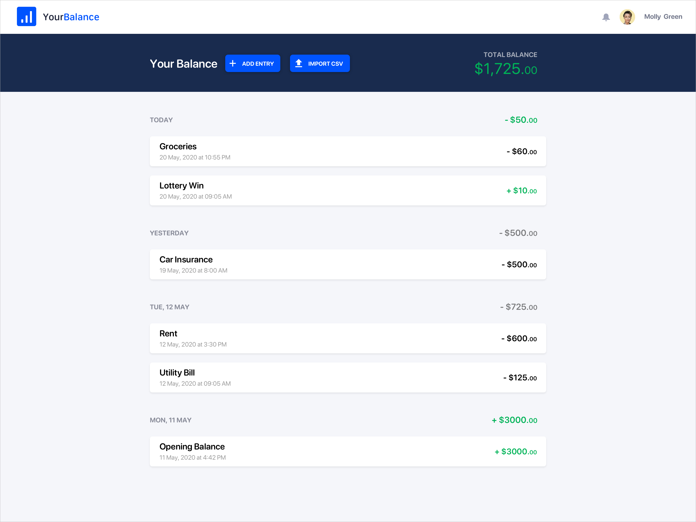
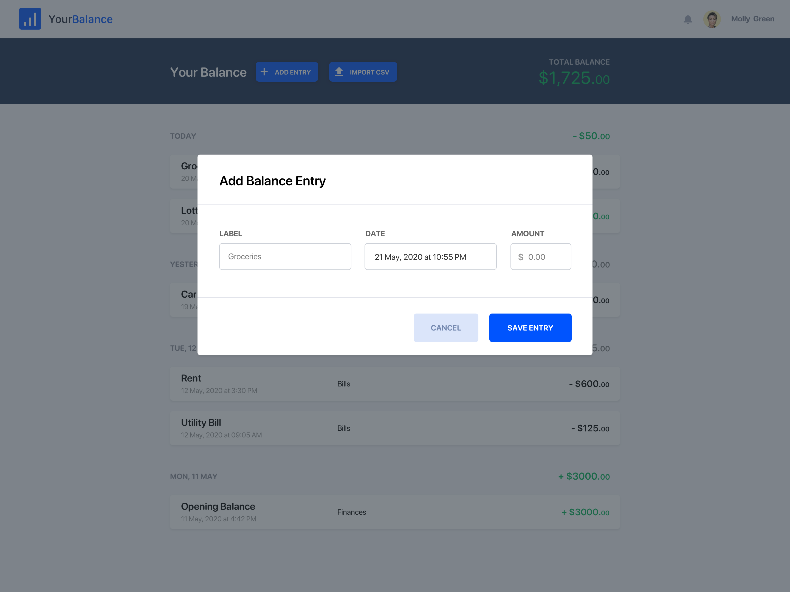
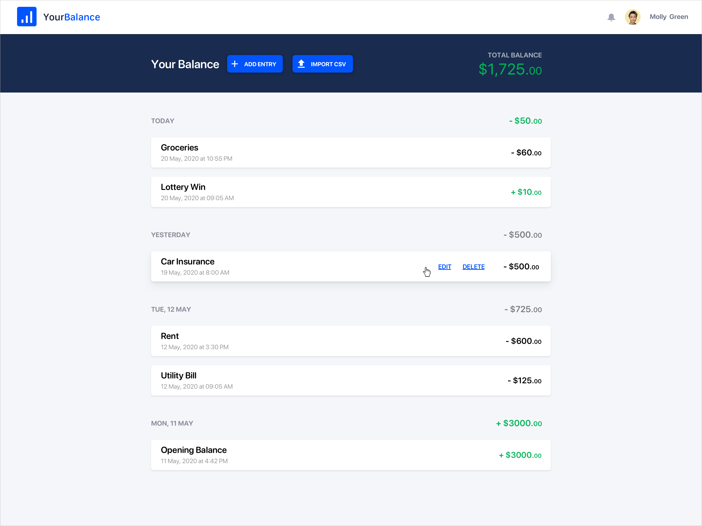
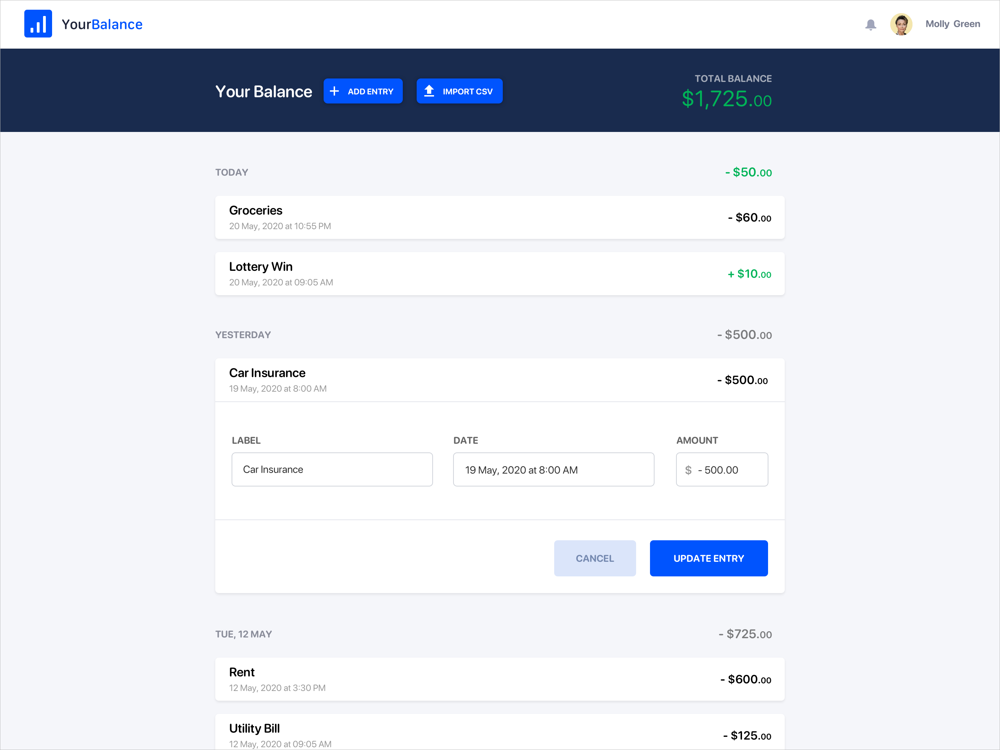
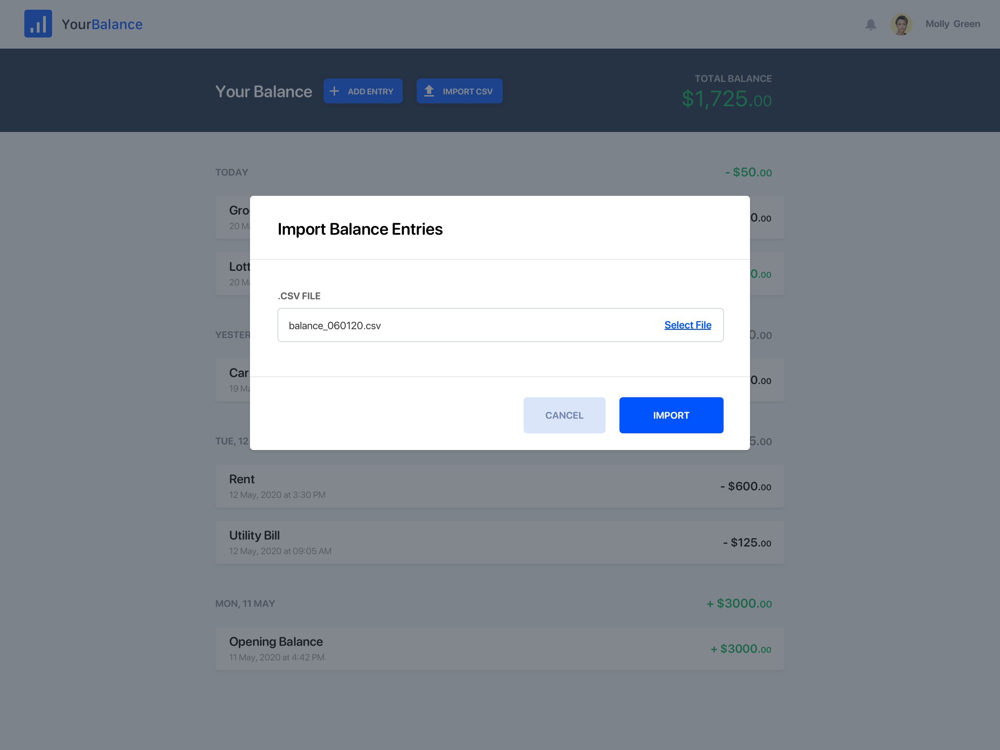
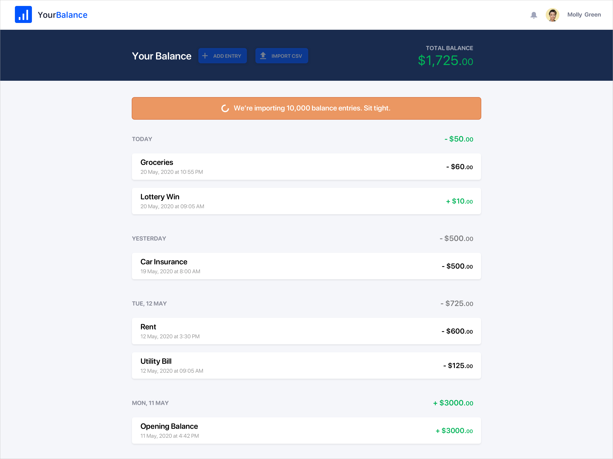

# Finance App Trial Project

This project proposal has been put together to help developers who are applying for new positions but don't have any sample code to provide during the hiring process.

We've put together a basic Laravel starter app, which includes authentication scaffolding. To get started, run the following commands:

```
composer install
php artisan migrate
npm install
npm run dev
```

After signing up, you'll be redirected to the user's dashboard. This is a static HTML representation of the [dashboard mockup](#dashboard) built using Tailwind CSS.

## Requirements

The trial project should be built using Laravel and Vue.js and should demonstrate your abilities with these frameworks. The project is split into two deliverables: a CRUD app and a CSV import feature.

### Phase 1 - CRUD

#### Dashboard

A list of the user's balance entries should be shown by default. Entries should be grouped by date. Although pagination is missing from the mockups, feel free to add basic pagination if you get time.



#### Add Entry

A user should be able to add single balance entries. Adding a new entry should update the balance list and the total balance.



#### Edit & Delete Entry

Hovering over an entry should show the edit and delete links.



Clicking 'Delete' should remove the entry from the list and update the total balance. Clicking 'Edit' should reveal the edit form.



Clicking 'Update Entry' should update the balance list and update the total balance.

### Phase 2 - Import Entries

A [CSV file](data/5000-balance-entries.csv) of entries can be imported. The import should happen in the background. The 'Add Entry' and 'Import CSV' buttons should be disabled while the import is working, however, existing entries can be edited or deleted.



Imported entries should not appear in the balance list, until the entire import has completed. When the import is running, a notice should be shown with the count of entries currently being imported.



## Get Started

1. Please track your time to give us an idea of how long it takes you to complete each phase of the project.
1. It's not required, but you get massive bonus points if you record a screencast with commentary as you code this project, showing us how you're thinking through the problems you face and how you tackle the project from start to finish.
1. Fork this repo
1. If you make your forked repo private, grant access to the following users: @A5hleyRich, @georgefehr, @bradt, @Jamesclark32
1. Create a new `phase1` branch off of the `master` branch and make all your commits for Phase 1 to that branch
1. When it's ready for review, push the branch to your GitHub repo
1. Open a pull request (PR) against **your repo** (not deliciousbrains/finance-app-trial-project) to merge your branch into the `master` branch
1. Reply to our email thread (or if you haven't emailed us yet, send a new email to &#119;&#111;&#114;&#107;&#064;&#115;&#112;&#105;&#110;&#117;&#112;&#119;&#112;&#046;&#099;&#111;&#109;) and let us know that Phase 1 is ready for review with a link to the PR and how much time you've put in so far
1. Now you can either wait for our code review or continue with Phase 2, completely up to you
1. When you're ready to proceed with Phase 2, create a new `phase2` branch off of the `phase1` branch
1. When it's ready for review, push the branch to your GitHub repo and open another PR to merge the branch into the `master` branch
1. Reply to our email thread and let us know that Phase 2 is ready for review with a link to the PR and how much time you've put in so far
